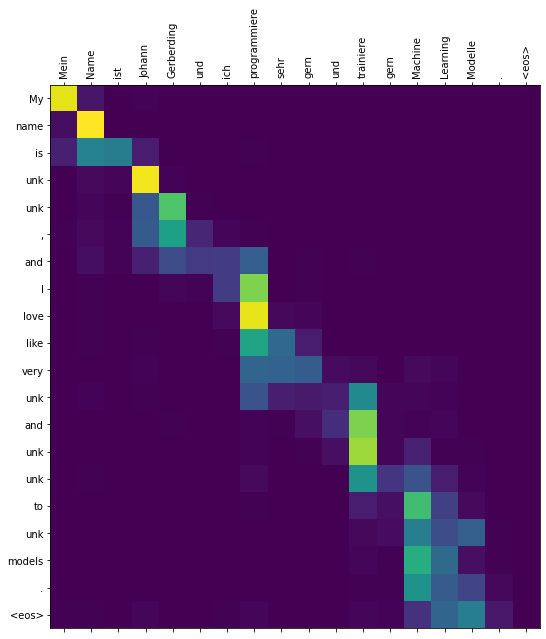

```
Length of vocab [de - IWSLT2017]: 16713
Length of vocab [en - IWSLT2017]: 14016


Load model checkpoint: /home/domp/pytorch-RNNsearch/experiments/2021-11-21_IWSLT2017/best.pth

Seq2Seq(
  (encoder): Encoder(
    (embedding): Embedding(16713, 256)
    (rnn): GRU(256, 512, bidirectional=True)
    (fc): Linear(in_features=1024, out_features=512, bias=True)
    (dropout): Dropout(p=0.5, inplace=False)
  )
  (decoder): Decoder(
    (attention): Attention(
      (attn): Linear(in_features=1536, out_features=512, bias=True)
      (v): Linear(in_features=512, out_features=1, bias=False)
    )
    (embedding): Embedding(14016, 256)
    (rnn): GRU(1280, 512)
    (fc_out): Linear(in_features=1792, out_features=14016, bias=True)
    (dropout): Dropout(p=0.5, inplace=False)
  )
)

============================================================
SRC:	Vor einigen Jahren , hier bei TED , stellte Peter unk einen unk namens " Die unk " vor .
TGT:	Several years ago here at TED , Peter unk   introduced a design challenge   called the marshmallow challenge .
------------------------------------------------------------
PRED:	A couple years ago , at TED TED , Peter Peter unk a unk called " The unk unk . "
============================================================
SRC:	Die Idee ist ziemlich einfach . unk müssen die unk unk Struktur mit 20 unk , ca. 1 m Klebeband , ca. 1 m Faden und einem Marshmallow bauen .
TGT:	And the idea 's pretty simple :   unk of four have to build the tallest free - standing structure   out of 20 sticks of spaghetti ,   one yard of tape , one yard of string   and a marshmallow .
------------------------------------------------------------
PRED:	And the idea is pretty simple . unk , to have to unk the unk unk structure of 20 - 20 - , , about a a mile , about a a of a .
============================================================
SRC:	Der Marshmallow muss oben drauf sein .
TGT:	The marshmallow has to be on top .
------------------------------------------------------------
PRED:	The the needs to be be on top .
============================================================
SRC:	Und , obwohl es wirklich einfach scheint , ist es tatsächlich richtig schwer , weil es Leute drängt sehr schnell zusammenzuarbeiten .
TGT:	And , though it seems really simple , it 's actually pretty hard   because it forces people   to collaborate very quickly .
------------------------------------------------------------
PRED:	And even though it 's really simple , it 's really really hard really hard , because it 's very very close to people very quickly .
============================================================
SRC:	Und so dachte ich , dass dies eine interessante Idee ist und ich habe es in einen unk verwandelt .
TGT:	And so , I thought this was an interesting idea ,   and I unk it into a design workshop .
------------------------------------------------------------
PRED:	And so I thought that this is an interesting idea , and I 've turned into a unk . .
============================================================
SRC:	Es war ein riesiger Erfolg .
TGT:	And it was a huge success .
------------------------------------------------------------
PRED:	It was a huge success .
============================================================
SRC:	Seitdem habe ich ungefähr 70 Workshops weltweit durchgeführt , mit Studenten , unk und Architekten , sogar mit unk der unk und da ist etwas an dieser Aufgabe , was tiefe Eindrücke in die Natur der Zusammenarbeit ermöglicht und ich möchte einige davon mit Ihnen teilen .
TGT:	And since then , I 've conducted   about 70 design workshops across the world   with students and designers and architects ,   even the unk of the Fortune 50 ,   and there 's something about this exercise   that reveals very deep lessons   about the nature of collaboration ,   and I 'd like to share some of them with you .
------------------------------------------------------------
PRED:	Since since I 've done about 70 around the world , students students , unk and architects , even with the unk of the , and there 's something of creating a deep - of - of nature of the and and I want to share some of those of you .

TRANSLATION
==================================================
SOURCE: Mein Name ist Johann Gerberding und ich programmiere sehr gern und trainiere gern Machine Learning Modelle . <eos>
--------------------------------------------------
PREDICTION: My name is unk unk , and I love like very unk and unk unk to unk models .
```

```
TRANSLATION
==================================================
SOURCE: Er liebt Bücher und gutes Essen mehr als alles andere . <eos>
--------------------------------------------------
PREDICTION: He loves books and and food food more than anything else .
```


```
TRANSLATION
==================================================
SOURCE: Mathematik und Physik waren seine liebsten Fächer in der Schule . <eos>
--------------------------------------------------
PREDICTION: unk and physics were the most unk in school school .
```

```
TRANSLATION
==================================================
SOURCE: Peter liebt es mit dem Fahrrad zur Arbeit zu fahren . <eos>
--------------------------------------------------
PREDICTION: Peter was trying to work with the bicycle .
```

```
TRANSLATION
==================================================
SOURCE: Künstliche Intelligenz und programmieren macht einfach Spaß . <eos>
--------------------------------------------------
PREDICTION: unk intelligence and and simply simply fun .
```


# Bleu Score

Down below I evaluate the model on the test set based on the Bleu Score (https://aclanthology.org/P02-1040.pdf) using two different ngram values, 3 & 4. The Bleu Score is often used for evaluation in Neural Machine Translation.

```
bleu4
100%|█████████████████████████████████████████████████████████████████████████████████████████████████████████████████████| 1568/1568 [14:45<00:00,  1.77it/s]
16.33

bleu3
100%|█████████████████████████████████████████████████████████████████████████████████████████████████████████████████████| 1568/1568 [15:02<00:00,  1.74it/s]
25.19
```
